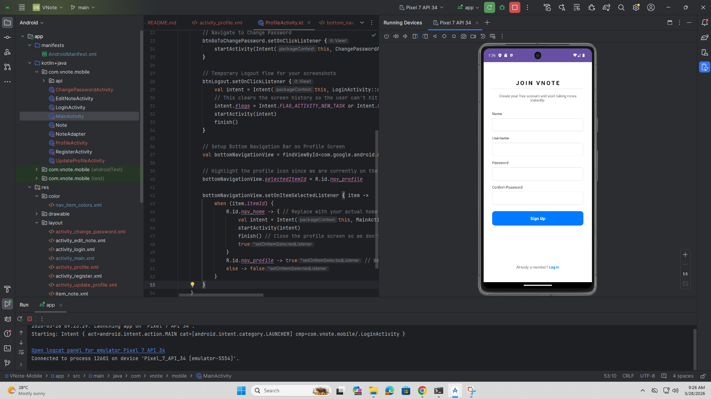
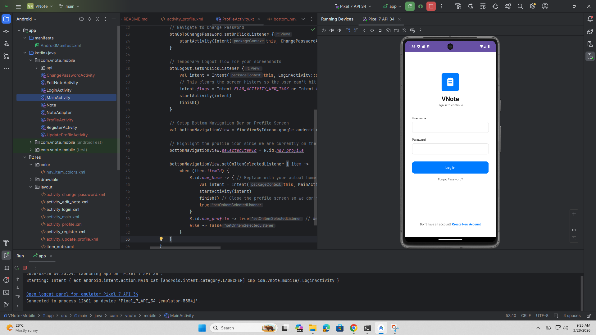
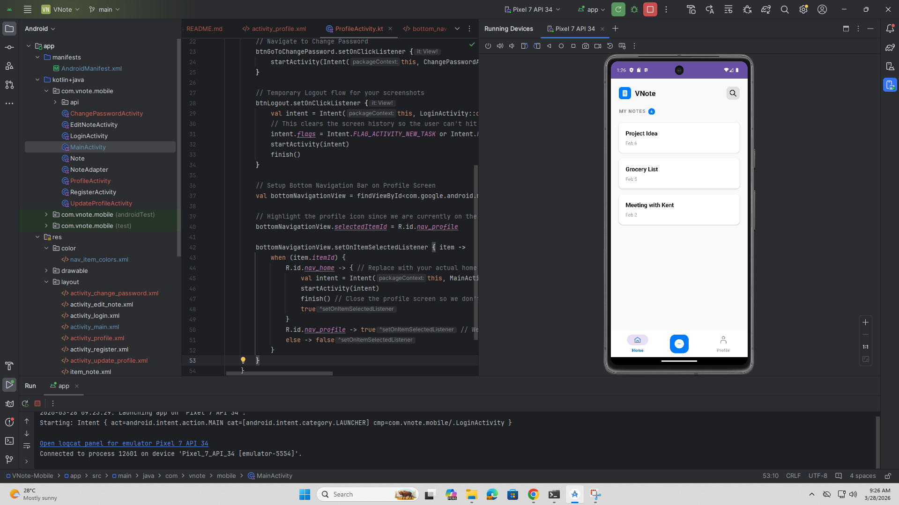
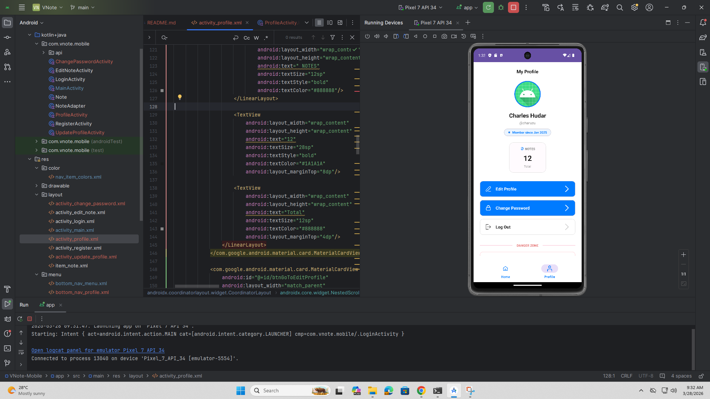
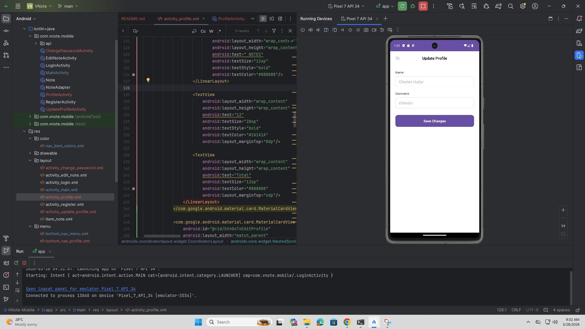
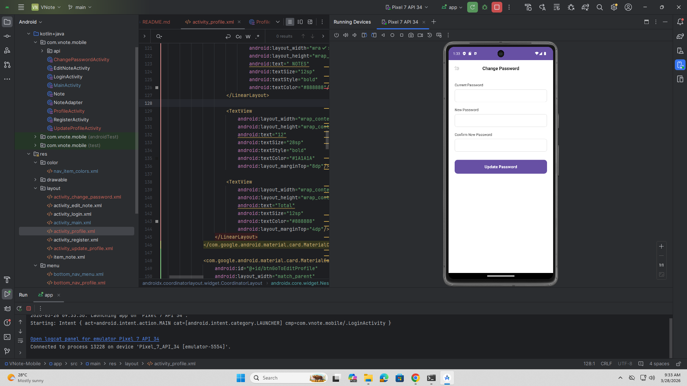

# VNote Mobile Application

**Android App Development + Backend API Integration**

VNote is a sleek, modern Android application that integrates with a Spring Boot backend API. It features full user authentication (Register/Login) utilizing Bearer Tokens, secure profile management, and dashboard navigation.

## Features & API Integration
* **Authentication:** Secure Login and Registration handling HTTP status codes (200, 400, 401, 500).
* **API Client:** Built using Retrofit2 with Gson conversion.
* **Error Handling:** Graceful UI fallbacks for network errors, invalid credentials, and server outages.
* **UX/UI:** Clean Material Design with loading indicators and disabled states during network calls.

---

## Application Screenshots

### 1. Register

### 2. Login

### 3. Dashboard

### 4. Profile

### 5. Update Profile

### 6. Change Password
